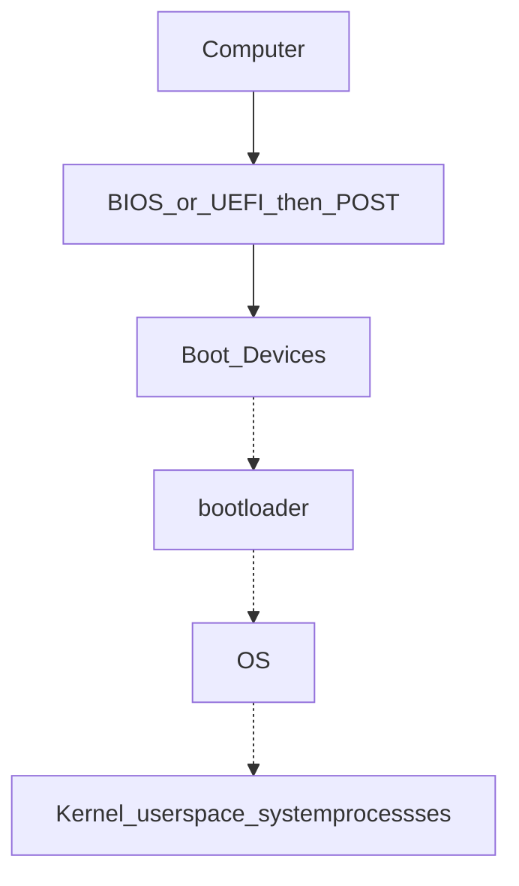

# IT Support Fundamentals

## Modules 1: Introduction

IT support mindset - computing technology, it's about people

* Logic gates `NOT, AND, OR, XOR, NAND, XNOR`

## Module 2: Hardware

**Common CPU** → Intel Core i7, AMD Athlon, Snapdragon 810, Apple A8 _Always ensure that is CPU compatible with Motherboard_

#### 2 Major type of CPU

* **LGA Socket** - pins coming out of the Motherboard
* **PGA Socket** - pings coming out of the processor CPU has **32** bit or **64** bit architecture

For numerical accuracy → **Decimal nomenclature** < **Binary nomenclature**

```
KB → 1,000 bytes
KiB → 1,024 bytes (Kibibytes)
```

Common power adaptor → 2.1 AMPS 500W enough for Desktop computers

| Version | Speed    | Actual Data Transfer Speed |
| ------- | -------- | -------------------------- |
| USB 2.0 | 480 Mb/s | 35-40 MB/s                 |
| USB 3.0 | 5 Gb/s   | 300 MB/s                   |
| USB 3.1 | 10 Gb/s  | 1.2 GB/s                   |

**DC** (Direct Current) - one direction **AC** (Alternating Current) - back and forward directions

**Common voltages** → 110-120 VAC (voltage of AC), 220-240 VAC

**Power Supply** → 20-24 pins to connect wires

**System on chip** (SoC) **BYOD** - _Bring your own device_, policy of permitting

**Types of Cables**

* **Plane Old Telephone Service** (POTS) - telephones, dial-up, alarm systems
* **Digital Subscriber Line** (DSL) - RJ-45
* **Cable Internet**
* **Fibre-optic Cable** - long-distance, higher speed, ISPs
* **Punch Down Blocks** - quick and easy way to connect wiring

**4-pin Molex** - Fan speed

#### How Devices work with CPU

**I/O** devices → drivers (BIOS), which is stored in a tiny chip called **ROM** → CPU

**UEFI** - Unified Extensible Firmware Interface **POST** - Power On Self Test

**Display Monitors**

* **LCD** - Liquid Crystal Display
* **LED** - Light Emitting Diodes
* **IPS** - In Plane Switching (Touchscreens)
* **Twisted Nematic** - _low, fast fresh rates_
* **VA** - Vertical Alignment
* **OLED, AMOLED** - Inorganic mini LEDs (mLEDs)

**North Bridge**

High speed communications: RAM, PCI Express, video cards, high bandwidth devices

**South Bridge**

Lower bandwidth communications: SATA drives, USB ports, audio interfaces, network connections

**SATA**: Serial AT Attachment, that is a computer bus interface for storage devices

## Module 3: OS

How OS works

```
User Space
- Apps
↕
Kernel Space
- Process manager --- memory optimisation
- Memroy manager
- File manager
- I/O manager
↕
Hardware - drivers - for e.g. keyboard, headphones
```

**Metadata** - Owner, date, ...

**Time slice** - allocation for CPU to process (works with pages) Kernel creates processes

> \[!TIP] Shell Most remote accessed with CLI, not GUI everytime. Bash - _Born Again Shell_

## Module 4: Networking

**Logs** - record event system




#### Networks

**IP** - right address, **TCP** - delivers **ICANN** - Internet Corporation for Assigned Names and Numbers

_When you type an address in browser, DNS looks IP and search address_

**IPv4** - 32 bits **IPv6** - 128 bits **NAT** - Network Address Translation

#### Security

**COPPA** - Children's Online Privacy Protection Act

## Module 5: Software

* **PowerShell** (`.ps1`) - Built on .NET platform and used for automating system management on Windows.
* **Batch Scripts** (`.bat`) - Simple tasks, calling a set of programs on startup
* **Visual Basic Script** (`.vbs`) - Old and replaced by PowerShell.
* **Shell Script** (`.sh`) - executing programs on Unix systems on BASH, Bourne Shell, KSH, C schell

Application software, system software, firmware (permanently stored on computer component) **Script** is interpreted by CPU

## Module 6: Troubleshooting

_Ask right questions_ Shrink the problem to focus on a scope Ask what you mean it's stop working, when, and how. Your time and your user time is **important**

you'll encounter the same issue over and over again Don't rely on _auto-pilot_ Gather data so you understand the issue - don't reply

Always find the **root cause** you gonna need passionate | problem-solving (tools | resources) | Communication (Knowing their needs)

Twist your styles on different situations because you will meet different types of people - build a trust in communication - ask your manager to know approach and restrictions of the company **Great Customer Service**

* Empathy - The action you take by looking at it from their perspective is what **empathy** all about.
* If your tone is **Friendly and curious** - users have more positive experience

#### Great Success

* Exhibiting empathy
* Being conscious of your tone
* Acknowledging the person you're talking to
* Developing trust with the user

Instead of going awkward while troubleshooting (on call/text/email), say "I gotta research on this issue, would you mind waiting 5 mins?" Builds more confident between you and the user Say sorry for **repeative questions.**

#### Interaction

When user asks so many questions while you troubleshooting, say "I'd be happy to answer all of your questions, but I wanna look up for this now. Your questions will be wrote down so I won't forget!"

#### Dealing with Difficult Situations

Take a deep breath, look around for people who are more engaged with you that pays attention. Ask yourself why you're heated up, and calm down.

> User get frasturated with same questions over and over again. _why the calender app doesn't open? it doesn't just load when you press to open or not syncing?_

Try to pause before you speak for 5 to 10 secs, ask your **why the user talking over me? or did I miss anything?** then think about what you want to say.

#### Tickets System (Documentation)

You need to document your works to remember how you did:

* It keeps the user in the loop
* Helps you audit your steps in case you need to go back and see what you did.

**Update documentations** (concise as possible -- they are technical, not short story)

Documentation should be straight, clear problems, questions, specific steps. **Ticketing or bug system**:

* User entry: question
* Support specialist entry: specific troubleshooting process to manage them

## Technical Interview

Make your **Resume** (first introduction to the company) clear to read and strong fit for job apply. Read carefully the **Job Description**

Simplified breif summary of your all experiences _Created acccounts, deleted accounts --- Administered and maintained all user accounts_

> Action Verb + specific task + quantifiable point

Also add personal projects that you're interested.

**Make your online presence Professional**

> Always pretend you're in an interview -- makes you confident and can say more out loud.

Practice with non-technial people -- practice to break down complex topic into simple and explain with basic terms.

> Try explaining the same concept in different ways -- allows for natural conversation

**Creating Your Elevator Pitch**

A short description about yourself like meeting in elevator

> \[!NOTE] What, where, looking forward "_Hello! I'm Martin, I'm in my first year at NiT University, studying Diploma in Computing. I enjoy learning about security and helping in Networking though I'm still inexperienced, so I'm looking forward to putting my tech skills into practice by working as an Security Operation Analystic after I graduate._"

**Having a good problem-solving strategy is more important than knowing all the answers** --- say how you'll research the solution if you don't know.

Be prepared to explain a concept when you choose over another. Take notes, break down concepts.

#### Good Night Sleep

* Be yourself, be fully present to your interviewer.
* Also an opportunity to ask the interviewer to ask for things you care about.

In secnarios -- get the pirorities right.
